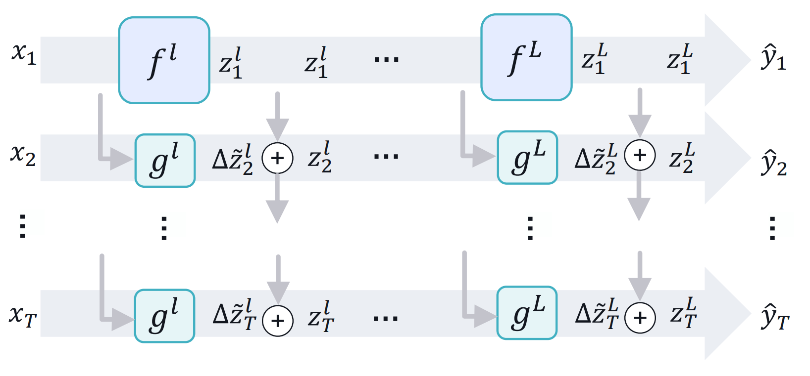

# Delta Distillation for Efficient Video Processing

This repository contains the implementation and experiments for the paper presented in

**Amirhossein Habibian<sup>1</sup>, Haitam Ben Yahia<sup>1</sup>, Davide Abati<sup>1</sup>, Efstratios Gavves<sup>2</sup>, Fatih Porikli<sup>1</sup> "Delta Distillation for Efficient Video Processing", ECCV 2022.** [[arXiv]](https://arxiv.org/abs/2203.09594)

<sup>1</sup> Qualcomm AI Research (Qualcomm AI Research is an initiative of Qualcomm Technologies, Inc.),
<sup>2</sup> University of Amsterdam

You can use this code to recreate the main results in the paper.

## What is Delta Distillation?
Delta Distillation is a technique to speed-up the processing of videos. 
Let's say you have a stream of frames and a neural network that processes them one by one.
Now let's assume this model is very accurate, but also expensive in terms of computation.
How can you approximate the same results while easing the cost?

With Delta Distillation, the first frame (keyframe) is processed as usual, whereas all successive ones get represented as differences with respect to the keyframe (deltas).
Due to the high degree of temporal redundancy in video sequence, deltas convey way less information than raw video frames, and can be processed with a smaller model.
This is exactly what Delta Distillation does: in every layer (teacher), the delta representation is computed with respect to the keyframe, and it is processed by a sibling layer (student) designed to be much cheaper.
This operation regresses the delta in the output of the original layer, whose representation can be approximated by summing the keyframe features, as follows: 



During training, the student layers are trained with knowledge distillation, and the teacher provides them deltas in output representations as targets.
 
For more details, we redirect the interested reader to the [full technical paper](https://arxiv.org/abs/2203.09594).

## Getting started

#### Preparing datasets

We will use a centralized folder to contain the datasets of interest.
Please select any path that suits your need, and save it into an environment variable `DATASET_PATH`.
Then, arrange the data as follows.

If you're interested in video object detection, please download ImagenetVID under `$DATASET_PATH/imagenet`. 
Also, to perform training, both ImagenetDet and ImagenetVID are required:

```
$ tree -L 3 $DATASET_PATH/imagenet

imagenet
└── ILSVRC2015 
    ├── Annotations 
    │   ├── DET 
    │   └── VID 
    |   └── *.json
    ├── Data 
    │   ├── DET 
    │   │   └── VID 
    └── ImageSets 
        ├── DET 
        ├── VID 
        └── *.txt
```

In the case you want to experiment with semantic segmentation, please download Cityscapes under `$DATASET_PATH/cityscapes`:

```
$ tree -L 1 $DATASET_PATH/cityscapes

cityscapes
├── gtFine
├── leftImg8bit
├── leftImg8bit_sequence
├── train.lst
├── val.lst
└── *
```

#### Downloading checkpoints

Similar to what we did with data, please prepare a checkpoint folder and store it into an environment variable `CHECKPOINT_PATH`.
Then, checkpoints can be downloaded and extracted as:

```
TODO: Modify this with github links.
wget --no-check-certificate -P $CHECKPOINT_PATH <link-to>checkpoints.zip.001
wget --no-check-certificate -P $CHECKPOINT_PATH <link-to>checkpoints.zip.002
wget --no-check-certificate -P $CHECKPOINT_PATH <link-to>checkpoints.zip.003
cd $CHECKPOINT_PATH

cat checkpoints.zip.* > checkpoints.zip
zip -FF checkpoints.zip --out checkpoints-full.zip
unzip checkpoints-full.zip
```

Please make sure that you get the following structure:
```
$ tree $CHECKPOINT_PATH

$CHECKPOINT_PATH
├── test
│   ├── ddrnet-23.pth
│   ├── ddrnet-23s.pth
│   ├── ddrnet-39.pth
│   ├── efficientdet_d0.pth
│   ├── faster_rcnn.pth
│   └── hrnet-w18-small.pth
└── train
    ├── ddrnet-23_frame_based.pth
    ├── ddrnet-23_macs.p
    ├── ddrnet-23s_frame_based.pth
    ├── ddrnet-23s_macs.p
    ├── ddrnet-39_frame_based.pth
    ├── ddrnet-39_macs.p
    ├── efficientdet_macs.p
    ├── efficientdet.pth
    ├── faster_rcnn_frame_based.pth
    ├── faster_rcnn_macs.p
    ├── hrnet-w18-small_frame_based.pth
    └── hrnet-w18-small_macs.p

```

The `test` folder contains pretrained delta-distilled models, to perform inference with. 
The `train` folder contains pretraining of the original network, to start training from, along with layer-wise MAC measurements needed in the optimization.


#### Environment setup

First, let's define the path where we want the repository to be downloaded:
```
REPO_PATH=<path/to/repo>
```

Now we can clone the repository:
```
git clone git@github.com:Qualcomm-AI-research/delta-distillation.git $REPO_PATH
cd $REPO_PATH
```

Build the docker image:
```
docker build -f docker/Dockerfile --tag deltadist:0.1 .
```

Run the container, mounting the dataset folder
```
docker run -v "$DATA_PATH:/deltadist/datasets" -v "$CHECKPOINT_PATH:/deltadist/checkpoints" --gpus all --shm-size 1G --name deltadist -it --rm deltadist:0.1
```

We are now ready to run the experiments!

## Repository structure

This repository is structured in the following folders:
- `config` contains configuration files containing paths for datasets and checkpoints, as well as hyperparameters to instantiate the models and to run the training and validation scripts.
- `docker` is where resources to build the environment are stored, such as the Dockerfile and the pip requirements.
- `lib` is where most code is located. More specifically:
  - `lib/datasets` implements the dataset classes and anything related to data handling
  - `lib/handlers` contains atomic functions to evaluate and train the models. These will be called by the entrypoint scripts.
  - `lib/models` holds code to instantiate the backbone models, as well as the delta distillation core functionalities (in `lib/models/delta_distillation`)
  - `lib/scripts` provides entrypoint scripts to perform training and evaluation of models.
  - `lib/utils` contains some utility functions.
 
## Running the experiments

We tested Delta Distillation on several architectures for semantic segmentation (Cityscapes) and video object detection (Imagenet VID).
In this repository, you can find an implementation of Delta Distillation for linear blocks (single convolutions). 
Here are the results you can expect by running this code:

| Task | Dataset | Model | Original | Delta Distillation       |
|---|---|---|---|--------------------------|
| Semantic Segmentation | Cityscapes | DDRNet23 slim | mIoU 76.1 @ 36.6 GMac | mIoU 76.22 @ 17.67 GMac  |
| Semantic Segmentation | Cityscapes | DDRNet23 | mIoU 78.7 @ 143.7 GMac | mIoU 78.94 @ 71.39 GMac  |
| Semantic Segmentation | Cityscapes | DDRNet39 | mIoU 79.5 @ 282 GMac | mIoU 79.94 @ 139.37 GMac |
| Semantic Segmentation | Cityscapes | HRNet-w18-small | mIoU 76.1 @ 77.9 GMac | mIoU 75.72 @ 43.0 GMac   |
| Video Object Detection | ImageNet VID | EfficientDet D0 | mAP 69.0 @ 2.50 GMac | mAP 66.0 @ 0.63 GMac     | 
| Video Object Detection | ImageNet VID | Faster-RCNN (R101) | mAP 74.5 @ 149.1 GMac | mAP 73.5 @ 28.81 GMac    | 

Please note this code yields slightly different results than the paper, due to minor details in the MAC counting code and due to different training seeds.

Also note that this repository does not support training segmentation models with pseudo annotations (see Sec 4.2 of the paper, paragraph "Dataset and metrics").
Instead, code in this repo trains segmentation model by applying the task loss on the last frame only (for which human labeling is available).
Results may vary slightly because of this.

#### Inference

Inference can be run on a single GPU for all models by running the following commands. 
For the video object detection models, inference can take a few hours. 

* Semantic segmentation: DDRNet23 slim
````
python lib/scripts/test/segmentation/evaluate.py config/data/cityscapes.yml config/models/ddrnet-23s.yml config/models/delta_distillation.yml config/scripts/test-segmentation.yml --checkpoint.init /deltadist/checkpoints/test/ddrnet-23s.pth
````
* Semantic segmentation: DDRNet23
````
python lib/scripts/test/segmentation/evaluate.py config/data/cityscapes.yml config/models/ddrnet-23.yml config/models/delta_distillation.yml config/scripts/test-segmentation.yml --checkpoint.init /deltadist/checkpoints/test/ddrnet-23.pth 
````
* Semantic segmentation: DDRNet39
````
python lib/scripts/test/segmentation/evaluate.py config/data/cityscapes.yml config/models/ddrnet-39.yml config/models/delta_distillation.yml config/scripts/test-segmentation.yml --checkpoint.init /deltadist/checkpoints/test/ddrnet-39.pth 
````

* Semantic segmentation: HRNet-w18-small
````
python lib/scripts/test/segmentation/evaluate.py config/data/cityscapes.yml config/models/hrnet-w18-small.yml config/models/delta_distillation.yml config/scripts/test-segmentation.yml --checkpoint.init /deltadist/checkpoints/test/hrnet-w18-small.pth 
````

* Video object detection: EfficientDet
````
python lib/scripts/test/detection/evaluate_efficientdet.py config/models/efficientdet.yml config/data/imagenet-vid.yml config/scripts/test-efficientdet.yml config/models/delta_distillation.yml --data.num_frames_test 10 --delta_distillation.factor_ch 16 --delta_distillation.channel_reduction_type min --checkpoint.init /deltadist/checkpoints/test/efficientdet_d0.pth 
````

* Video object detection: Faster-RCNN
````
python lib/scripts/test/detection/evaluate_faster_rcnn.py config/data/imagenet_vid_pairwise.py config/models/faster_rcnn_r101.py config/models/delta_distillation.yml config/scripts/test-faster-rcnn.py --delta_distillation.factor_ch 16 --delta_distillation.channel_reduction_type min --checkpoint.init /deltadist/checkpoints/test/faster_rcnn.pth 
````

#### Training

All our models have been trained with 4 NVIDIA Tesla-V100 gpus.

* Semantic segmentation: DDRNet23 slim
````
python -m torch.distributed.launch --nproc_per_node=4 --master_port=9992 lib/scripts/train/segmentation/train.py config/data/cityscapes.yml config/models/ddrnet-23s.yml config/models/delta_distillation.yml config/scripts/train-segmentation.yml --checkpoint.init /deltadist/checkpoints/train/ddrnet-23s_frame_based.pth --checkpoint.mac /deltadist/checkpoints/train/ddrnet-23s_macs.p --log.dir=log/train/segmentation/ddrnet23s
````
* Semantic segmentation: DDRNet23
````
python -m torch.distributed.launch --nproc_per_node=4 --master_port=9992 lib/scripts/train/segmentation/train.py config/data/cityscapes.yml config/models/ddrnet-23.yml config/models/delta_distillation.yml config/scripts/train-segmentation.yml --checkpoint.init /deltadist/checkpoints/train/ddrnet-23_frame_based.pth --checkpoint.mac /deltadist/checkpoints/train/ddrnet-23_macs.p --log.dir=log/train/segmentation/ddrnet23 
````
* Semantic segmentation: DDRNet39
````
python -m torch.distributed.launch --nproc_per_node=4 --master_port=9992 lib/scripts/train/segmentation/train.py config/data/cityscapes.yml config/models/ddrnet-39.yml config/models/delta_distillation.yml config/scripts/train-segmentation.yml --checkpoint.init /deltadist/checkpoints/train/ddrnet-39_frame_based.pth --checkpoint.mac /deltadist/checkpoints/train/ddrnet-39_macs.p --log.dir=log/train/segmentation/ddrnet39
````

* Semantic segmentation: HRNet-w18-small
````
python -m torch.distributed.launch --nproc_per_node=4 --master_port=9992 lib/scripts/train/segmentation/train.py config/data/cityscapes.yml config/models/hrnet-w18-small.yml config/models/delta_distillation.yml config/scripts/train-segmentation.yml --checkpoint.init /deltadist/checkpoints/train/hrnet-w18-small_frame_based.pth --checkpoint.mac /deltadist/checkpoints/train/hrnet-w18-small_macs.p --log.dir=log/train/segmentation/hrnet-w18-small
````
* Video object detection: EfficientDet
````
python -m torch.distributed.launch --nproc_per_node=4 --master_port=9992 lib/scripts/train/detection/train_efficientdet.py config/data/imagenet-vid.yml config/models/efficientdet.yml config/models/delta_distillation.yml config/scripts/train-efficientdet.yml --delta_distillation.factor_ch 16 --data.exclude_DET_images False --checkpoint.init /deltadist/checkpoints/train/efficientdet.pth --checkpoint.mac /deltadist/checkpoints/train/efficientdet_macs.p --log.dir log/train/detection/efficientdet --data.batch_size.train=8 --delta_distillation.channel_reduction_type min
````

* Video object detection: Faster-RCNN
````
python -m torch.distributed.launch --nproc_per_node=4 --master_port=9991 lib/scripts/train/detection/train_faster_rcnn.py config/data/imagenet_vid_pairwise.py config/models/faster_rcnn_r101.py config/models/delta_distillation.yml config/scripts/train-faster-rcnn.py --delta_distillation.factor_ch 16 --delta_distillation.channel_reduction_type min --checkpoint.init /deltadist/checkpoints/train/faster_rcnn_frame_based.pth --checkpoint.mac /deltadist/checkpoints/train/faster_rcnn_macs.p
````

## Citation

If you find this work useful for your research, please cite
```
@inproceedings{deltadist,
  title={Delta Distillation for Efficient Video Processing},
  author={Habibian, Amirhossein and Ben Yahia, Haitam and Abati, Davide and Gavves, Efstratios and Porikli, Fatih},
  booktitle={Proceedings of the 17th European Conference on Computer Vision},
  year={2022},
  organization={Springer}
}
```
----

This repository builds upon the following open source software. 
We would like to acknowledge the researchers who made these repositories open-source.
* [HRNet/HRNet-Semantic-Segmentation](https://github.com/HRNet/HRNet-Semantic-Segmentation)
* [ydhongHIT/DDRNet](https://github.com/ydhongHIT/DDRNet)
* [rwightman/efficientdet-pytorch](https://github.com/rwightman/efficientdet-pytorch)
* [open-mmlab/mmtracking](https://github.com/open-mmlab/mmtracking)
* [andreasveit/convnet-aig](https://github.com/andreasveit/convnet-aig)
